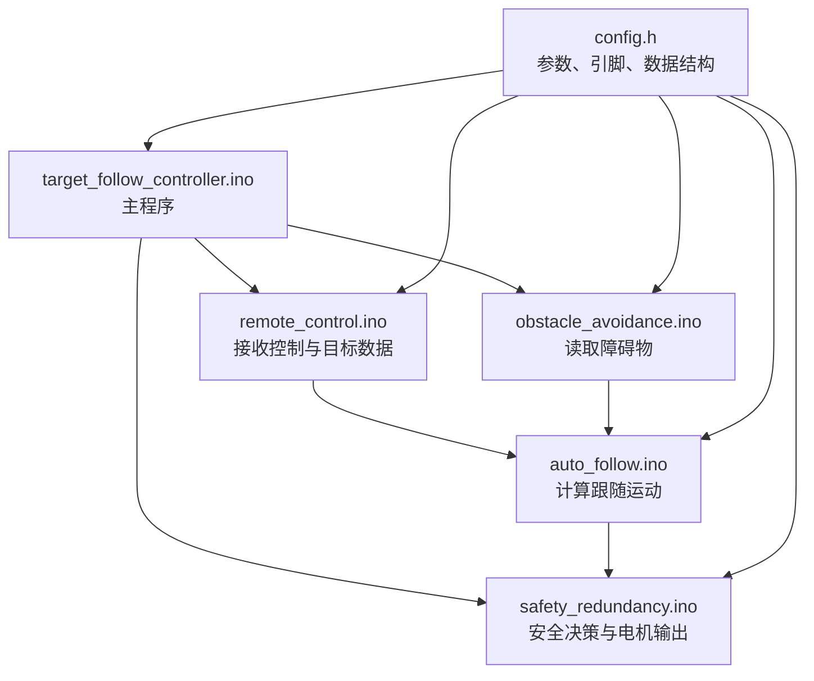

这套 Arduino 代码采用的是“主程序调度 + 功能模块 + 统一配置”的结构。虽然拆成多个 `.ino` 文件，但 Arduino 编译时会把同一文件夹中的 `.ino` 文件合并为一个程序。



### 1. `target_follow_controller.ino`：主程序

相当于项目入口，主要包含：

```cpp
void setup()
```

负责上电初始化，例如：

- 初始化电机安全模块；
- 初始化串口；
- 初始化遥控和手机通信；
- 初始化传感器；
- 初始化自动跟随模块。

以及：

```cpp
void loop()
```

负责循环调度：

1. 接收手机或电脑数据；
2. 更新传感器数据；
3. 根据当前模式生成运动指令；
4. 进行安全检查；
5. 将指令输出给电机。

它本身不负责复杂算法，主要负责“安排执行顺序”。

------

### 2. `config.h`：统一配置和公共定义

这里集中存放整个项目共用的内容。

包括：

- 电机和传感器总开关：

```cpp
#define MOTOR_ENABLED 1
#define SENSOR_ENABLED 0
```

- 电机引脚；
- 电机安装方向；
- 跟随距离阈值；
- 转向参数；
- 原地对准参数；
- PWM 安全上限；
- 数据结构和函数声明。

例如：

```cpp
struct MotionCommand {
    int leftSpeed;
    int rightSpeed;
    const char* reason;
};
```

修改车辆参数时通常先看这个文件。

------

### 3. `remote_control.ino`：输入与遥控层

主要负责接收外部指令，包括：

- 手机发送的目标数据；
- AUTO/MANUAL 等模式切换；
- 电脑发送的前后左右测试指令；
- 手柄控制；
- 急停或停车指令。

它会把输入转换成统一的 `MotionCommand`：

```cpp
command.leftSpeed
command.rightSpeed
```

例如电脑发送原地左转时：

```cpp
command.leftSpeed = -speed;
command.rightSpeed = speed;
```

------

### 4. `auto_follow.ino`：自动跟随决策层

这是目前跟随控制的核心，主要完成三个工作。

#### 距离控制

根据：

```cpp
target.relativeDistance
```

判断小车应该：

- 停止；
- 向前；
- 保持距离滞回；
- 进入近距离原地对准。

#### 普通跟随转向

根据：

```cpp
target.xError
```

通过非线性P控制计算 `turnSpeed`：

```cpp
leftSpeed  = forwardSpeed + turnSpeed;
rightSpeed = forwardSpeed - turnSpeed;
```

实现边前进边转弯。

#### 近距离原地对准

当目标进入停止距离但横向没有对准时：

```cpp
leftSpeed  = turnSpeed;
rightSpeed = -turnSpeed;
```

实现原地旋转。

因此这个文件回答的是：

> “小车现在应该怎么运动？”

但它不直接控制 Arduino 引脚。

------

### 5. `obstacle_avoidance.ino`：环境感知层

主要负责：

- 读取前、后、左、右传感器；
- 判断相应方向是否有障碍；
- 生成 `DistanceData`；
- 提供类似下面的判断函数：

```cpp
isFrontBlocked(distance)
isBackBlocked(distance)
isLeftBlocked(distance)
isRightBlocked(distance)
```

自动跟随和安全模块会调用这些判断。

目前：

```cpp
#define SENSOR_ENABLED 0
```

所以 Arduino 上的传感器检测被整体关闭，等待后续接入 STM32。

------

### 6. `safety_redundancy.ino`：安全执行层

这个文件位于所有运动指令与真实电机之间。

主要包含三层。

#### 选择并检查运动指令

```cpp
computeSafeMotionCommand()
```

综合考虑：

- 自动跟随；
- 手动遥控；
- 障碍物；
- 急停；
- 数据超时；
- 通信是否失效。

#### 限幅和平滑

```cpp
applySafeMotionCommand(command)
```

负责：

- 将输出限制在 `MOTOR_PWM_LIMIT` 内；
- 执行速度斜坡；
- 避免电机速度瞬间突变；
- 必要时强制停车。

#### 操作电机引脚

```cpp
setMotorSpeed(leftSpeed, rightSpeed)
```

继续调用：

```cpp
setMotor(...)
```

最终通过：

```cpp
digitalWrite(...)
analogWrite(...)
```

控制方向和PWM。

所以这个文件回答的是：

> “这个运动指令是否安全，以及最终怎样驱动电机？”

------

### 7. `battery_monitor.ino`：电池监测模块

负责：

- 读取电池检测模块；
- 计算电池电压；
- 判断电池是否欠压；
- 输出监测信息；
- 必要时参与安全停车。

它不参与跟随算法，只负责供电安全。

------

### 8. Python 测试脚本

这些不是 Arduino 固件，而是电脑端测试工具：

- `arduino_replay_test.py`：回放目标数据，测试整体状态机；
- `arduino_alignment_replay_test.py`：重点测试近距离原地对准；
- `arduino_motor_direction_test.py`：发送前、后、左、右指令，检查电机方向。

整体数据流可以概括为：

```text
手机/电脑/手柄输入
        ↓
remote_control.ino
        ↓
auto_follow.ino 计算左右目标速度
        ↓
safety_redundancy.ino 安全检查、限幅、平滑
        ↓
setMotor() 输出方向信号和PWM
        ↓
电机驱动板
        ↓
左右电机
```

因此，之后调试时可以这样定位：

- 跟随策略不合理：看 `auto_follow.ino`
- 参数大小不合理：看 `config.h`
- 电机方向或PWM异常：看 `safety_redundancy.ino`
- 手机/串口指令异常：看 `remote_control.ino`
- 障碍物误判：看 `obstacle_avoidance.ino`
- 程序执行顺序异常：看 `target_follow_controller.ino`